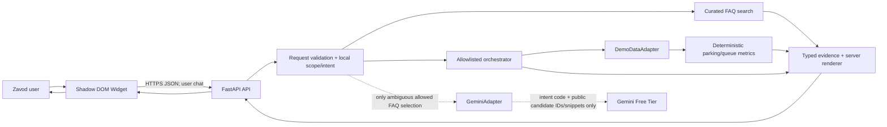

# 123YUK AI Support Agent — arxitektura

## Faktlar va cheklovlar

GitHub Pages `main` branch root’ini va `/123yuk-demo/` project base pathini serve qiladi. `zavod/` ichida route HTML’lar va production build JS/CSS bor; original app source, backend, API, auth va database repozitoriyda topilmadi. Zavod login oynasi o‘zidan DEMO xodim tanlash va demo data saqlashini ko‘rsatdi; undagi session/tokenlar yordamchining server authentifikatsiyasi emas. Dashboard brauzer localStorage demo seedini backend demo source sifatida ishlatish mumkin emas.

## Chegaralar

- **GitHub Pages:** compiled frontend va widget asset; CORS’da ruxsat beriladigan site origin `https://ayubjon1204.github.io`.
- **Widget:** standalone `<yuk-support-widget>` Web Component, Shadow DOM, history faqat memory, HTTP API URL script elementning `data-api-base-url` atributi yoki public JS config orqali.
- **FastAPI:** versionlangan endpoints, strict schemas, config/env, errors, CORS va process-local limits.
- **Request/privacy guard:** o‘zbek lotin Unicode normalization, apostrof normalization, aliases, intent classifier va scope gate. Message faqat 123YUK backendga uzatiladi. Faqat test qilingan, explicit classifier intent Gemini yo‘liga kira oladi.
- **FAQ service:** kichik curated JSON ko‘rinishidagi public, qisman user interfeysidan tekshirilgan article’lar; retrieval message/history’ni Gemini’ga jo‘natmaydi.
- **Agent:** pure orchestration; explicit tool allowlist, typed arguments/results; assistant response rendering backendda.
- **Gemini adapter:** HTTPX POST Gemini GenerateContent structured selection; secret faqat header `x-goog-api-key`; max timeout 15 s; SDK/framework va Google built-in tools ishlatilmaydi. Free-tier gate operator tasdig‘i; app project billingni tekshira olmaydi.
- **Demo adapter:** immutable, fake, typed fixtures; timezone-aware input sifatida frozen `demo_now`; har testda injection qilish mumkin.
- **Metrics:** sof Python functions, per-queue izolyatsiya, bitta snapshot va clockdan foydalanadi; model matematikasi hisoblamaydi.
- **Production adapter:** interface boundarygina. DB/ERP, OpenAPI integration, factory identity yoki sensitive data access MVP scope’da yo‘q.

## Component diagram



## Demo clock, snapshot va lifecycle

- `demo_now` biror timezone-aware Python `datetime` yoki ISO-8601 `Z` time; default `2026-10-10T07:00:00Z`. Startup’da bir marta parse qilinadi; client `demo_now`ni yubora olmaydi.
- `DemoSnapshot.data_as_of` fixture’da alohida immutable `2026-10-10T07:00:00Z`. Uni `demo_now`dan runtime hosil qilib yoki system clockdan olmaslik kerak.
- Umumiy clock/source tekshiruv: timezone-aware qiymatlarni UTCga normalizatsiya; `data_as_of > demo_now` => `FUTURE_DATA`; `(demo_now-data_as_of).total_seconds() > 300` => `STALE_DATA`; age `0..300` valid.
- Qiymat retrieval paytida snapshotni bir marta oling; shu requestdagi session count, queue count, event rates, sample va response timestamp hammasi shu snapshotdan hisoblanadi. Ma’lumotning as_of’i yangilanmaydi.
- History coverage `[coverage_start, coverage_end]` `data_as_of-60m`dan keyin boshlanmasligi va `data_as_of`gacha yetishi shart. Rate event oynasi `(data_as_of-60m,data_as_of]`; duplicate event_id bir marta hisoblanadi.
- Parking snapshotdagi faol, valid unique sessionsdan sanaladi; queue waiting ayni `queue_id` bo‘yicha valid active ticketsidan sanaladi. Physical parking va process queues bir metrikada jamlanmaydi.
- 24h completed duration query `data_as_of-24h`dan keyingi (`exit>start`), `exit<=data_as_of` sessiyalardan. Excluded count alohida qaytariladi.
- As of eski snapshotning demo countlari as-of label bilan ko‘rsatilishi mumkin. Stale/future/inconsistent/incomplete snapshot ustida forecast yo‘q.
- `DEMO_NOW` faqat app init config’da va unit test constructor injection’da, browser/API input’da emas. Har bir demo record source marker `demo_snapshot`; fixture `data_as_of` UIga “simulyatsiya vaqti” deb chiqadi.

## Request va AI ketma-ketligi

```mermaid
sequenceDiagram
  participant U as User
  participant W as Widget
  participant A as FastAPI
  participant C as Local classifier/scope guard
  participant F as FAQ/search
  participant T as Allowlisted backend tools
  participant G as Optional Gemini
  U->>W: Uzbek question
  W->>A: message + bounded, untrusted history
  A->>C: normalize current turn; local policy
  alt clear external topic
    C-->>A: OUT_OF_SCOPE
    A-->>W: exact scoped refusal, no evidence, no Gemini
  else genuinely ambiguous request
    C-->>A: CLARIFICATION_REQUIRED + safe suggestions
    A-->>W: clarifying question, no tool/LLM
  else exact low-complexity intent
    C-->>A: known local intent
    alt parking intent
      A->>T: typed parking or queue service
      T-->>A: immutable demo snapshot data
    else exact FAQ intent
      A->>F: local alias/relevance search
      F-->>A: verified public candidate IDs/snippets
      opt multiple same-topic FAQ candidates need AI ranking
        A->>G: intent code + approved public candidates ONLY
        G-->>A: proposed candidate IDs only
        A->>A: verify subset and intent match
      end
    end
    A->>A: render verified data/citations locally
    A-->>W: source, mode, demo notice, time metadata
  end
```

Raw current user question/history are allowed only from the widget to the configured 123YUK backend. Gemini never receives the raw text or history. History is untrusted; only user turns may be considered by local classifier for clarification. Assistant text and tool results are never trust/permissions.

## Public API and failure semantics

`docs/API_CONTRACT.md` is the single source of API schema. Demo mode is explicit in all normal responses. Liveness checks app process; readiness checks configured mandatory demo adapter/FAQ load, not optional Gemini. Typed local operations stay available with no Gemini key. Gemini’s missing/disabled/quota/timeout/provider failure is visible via `ai_status` and falls back only to matching confirmed local evidence; it cannot generate an answer. User’s exact required scope messages are constant strings. Code never renders provider free text, provider output as a verified value, or uncited operational fact.

Failure codes include `MISSING_SOURCE`, `CLARIFICATION_REQUIRED`, `OUT_OF_SCOPE`, `INSUFFICIENT_HISTORY`, `INSUFFICIENT_OBSERVATIONS`, `EMPTY_QUEUE`, `NON_POSITIVE_NET_RATE`, `PROCESS_MISMATCH`, `INCONSISTENT_DATA`, `STALE_DATA`, `FUTURE_DATA`, `LLM_DISABLED`, `LLM_NOT_CONFIGURED`, `LLM_QUOTA_EXCEEDED`, `LLM_TIMEOUT`, `LLM_PROVIDER_ERROR`, `RATE_LIMITED`, `INVALID_REQUEST`, `INTERNAL_ERROR`.

## Decisions

- **ADR-001 — compiled app safety:** inject an immutable, standalone asset reference into Zavod route HTML; do not edit minified JS/CSS. Keep a baseline and rollback by reverting injected tags and deleting only the new widget asset/source.
- **ADR-002 — provider privacy/cost:** only Gemini; closed-off default; POST only when explicitly verified; send only curated public evidence payloads for exact recognized public FAQ intents. Operator confirms the project has no active billing; app cannot verify billing. No fallback/retry/other model.
- **ADR-003 — local evidence first:** synonym/FAQ classifier local, deterministic tool calculation, API endpoints model independent, FAQ answers citation-backed.
- **ADR-004 — immutable demo time:** no wall clock or browser client clock; snapshot and demo_now independent; reason-coded availability.
- **ADR-005 — no real DB/schema/auth guesses:** injected read-only adapter is out of scope until factory isolation/data provenance/auth contract known.

## Deployment and security

Local developer run: Docker Compose FastAPI on port 8000, no Postgres/Redis. GitHub Pages holds static frontend only; run backend separately over HTTPS when privately approved/configured; API host is not known and user must set widget public base URL. Do not expose `backend/.env`, API keys, raw message logs, provider traces or personal data. No production data enabled. Demo supports controlled public data only; deploy requires a verified auth and factory authorization integration. CORS allowlist explicit, input caps and fixed window rate limiting per client IP are enforced before classifier/provider. Single worker required for in-memory limiter. Do not trust `X-Forwarded-For` from arbitrary proxy.

Failure: FAQ/tool results work when provider disabled; candidate lookup exact and bounded; if timeout/429/key error, return curated local candidate or clear unavailable status. `ready` true for local demo services only; provider outage never blocks calculations.
