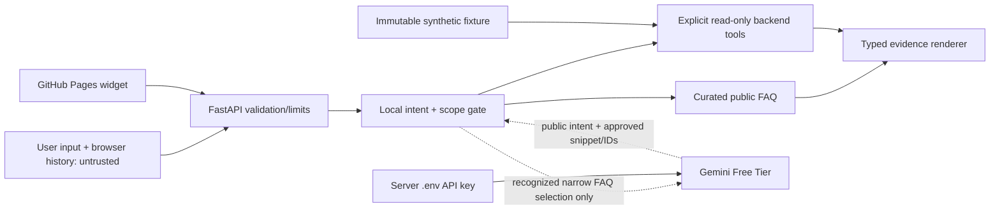

# 123YUK AI Support Agent — tahdid modeli

## Trust chegaralari

No production DB or authentication was observed. User-facing external data stays disabled. Future identity, factory ACL and verified source implementation are explicit production blockers.

## Tahdidlar va nazoratlar

| Tahdid | Nazorat | Regressiya testi |
|---|---|---|
| Prompt injection / Gemini system prompt | Never send raw question/history; allowlisted task only; send bounded public candidates; treat candidate selection as untrusted | Crafted user phrase/system tags absent from provider request and cannot cause new IDs/tool calls |
| Model fabricates operations/metrics | Provider output is typed candidate IDs only; IDs must be a subset of retrieved candidates; final answer assembled locally; no provider prose | Extraneous/refusal/new numeric model outputs never appear in response |
| Tool abuse / arbitrary SQL | Server registry of 3 explicit read-only tools; Pydantic typed arguments; no SQL, write tool or model-provided tenant | Invalid tool name/args/factory/queue rejected |
| Cross-role/factory access | Real data feature disabled; demo factory fixed server-side; role/frontend labels not auth | Forged roles/IDs cannot alter demo or turn on real adapter |
| Gemini API key leak | `backend/.env` ignored, backend only; header auth, not URL/client; no request header/body logs | Frontend bundle scan no secret; log capture redacts/no key |
| Accidental paid traffic | `GEMINI_FREE_TIER_CONFIRMED` default false; adapter short-circuit before HTTP; one exact allowlisted model; no retry, paid fallback, automatic billing | Request recorder proves zero calls false/disabled/empty key; quota gives no second request |
| Free tier user content/training/privacy | No raw message/history, customer/real data or operational values leave local service; allowlisted immutable public FAQ text/intent only. Operator confirms no sensitive/confidential/personal content in public FAQ. | Sentinel test against raw current text, all history and adapter output outbound payload |
| PII leakage via demo | All fixture vehicles fake IDs only; no live seeds/imports, plate, phone, name | Scan fixture/response for realistic identity/user fields; data is typed static |
| Scope bypass / off-topic answers | Local deterministic topic/alias classifier before candidate lookup; exact refusal; no provider invocation on OOS or ambiguity; exact no-source string | Explicit external query and prefix+external follow-up tests |
| Denial of service / body flood | Request body ≤32 KiB, message ≤2000 chars, history 12×2000, 60/min IP general/10/min IP chat, one provider request, 15 s timeout | Oversized, burst, timeout tests |
| CORS spoof / proxy identity spoof | Exact origin allowlist; no wildcard+credentials; untrusted `X-Forwarded-For` ignored; deploy behind explicitly configured TLS proxy | Cross-origin preflight only allowed host; forged proxy header not controls limit key |
| Sensitive telemetry | No chat text/provider response/private body in logs; safe error code+request ID only | Log capture and provider 4xx body tests |
| XSS/style leakage in widget | Shadow DOM, `textContent`, URL config only public, safe links disallowed by default | Script-like text remains inert; global CSS mutation does not change widget |
| Stale/wrong/demo data mistaken as live | static fixture provenance, immutable `data_as_of`, freeze clock, reason-coded staleness, every demo-data answer visibly labels unsynced snapshot | Current/future/301s stale/sufficient/insufficient times as fixed fixtures |

## Free Gemini privacy caveat

Official Unpaid Services terms state submitted content may improve/develop Google products and be human reviewed; no sensitive, confidential or personal information may be submitted. Scope of this service is non-confidential, public FAQ/topic selection only; do not send prompt/history, live records or secrets. A project with active Cloud Billing falls under Paid Services terms, so the operator must confirm the intended project has no active billing before enabling the gate; the configured `GEMINI_FREE_TIER_CONFIRMED` value is attestation, not an API billing audit. [Gemini additional terms](https://ai.google.dev/gemini-api/terms). Request provider’s active tier/rates from AI Studio; project limits change. [Rate limits](https://ai.google.dev/gemini-api/docs/rate-limits).

## Production gate

Before using real factory data, block the adapter until a verified auth provider/user identity, factory-level and object-level ACL, owner-approved storage/ERP schema, private deployment/origin, TLS, log retention policy, CORS/proxy and production key-management exist. No production data migration or DB setup is included here.
